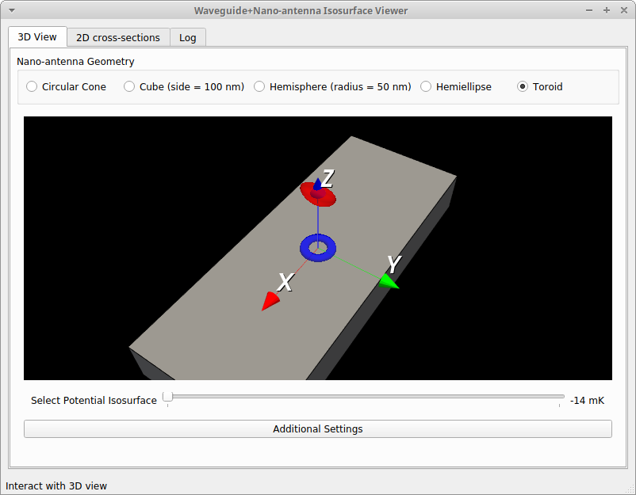

# Readme

My demo for PyQT and VTK programming, based on my paper on waveguide+nano-antenna-based atomic trapping[1].
* User can select of specific nanoantenna geometry
* User can show the 3D optical potential field for a given nanoantenna geometry

## Screenshot

## Credit

[Me](https://zemmyang.com)

I also used [STLWrite for Matlab](https://www.mathworks.com/matlabcentral/fileexchange/20922-stlwrite-write-ascii-or-binary-stl-files)

[1]: <https://doi.org/10.1364/OL.394557> "Angeleene S. Ang, Alexander S. Shalin, and Alina Karabchevsky, "Tailored optical potentials for Cs atoms above waveguides with focusing dielectric nano-antenna," Opt. Lett. 45, 3512-3515 (2020)"
